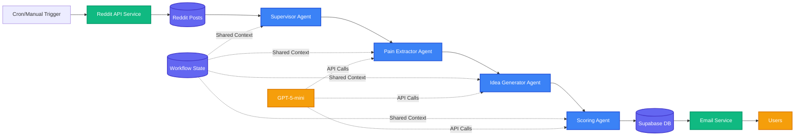

# AI Agent Architecture - Pain Radar (Simplified POC)

## Overview

This document describes the simplified AI agent architecture for the Pain Radar POC using LangGraph. The system focuses on core AI capabilities with a linear workflow, using regular functions for non-AI tasks.

## Architecture Diagram

**Interactive Version**: [View on MermaidChart](https://www.mermaidchart.com/d/24666025-cca2-43b6-9f71-7b0b8df5d089)



## Component Descriptions

### AI Agents (LangGraph)

#### 1. **Supervisor Agent**

- **Type**: Lightweight orchestrator
- **Purpose**: Coordinate the linear flow of AI agents
- **Responsibilities**:
  - Initialize workflow state
  - Pass data between agents
  - Handle errors gracefully
  - Track progress
- **Why it's an agent**: Manages dynamic workflow based on data

#### 2. **Pain Extractor Agent**

- **Type**: LLM-powered analyzer
- **Purpose**: Extract user problems from Reddit content
- **Input**: Raw Reddit posts and comments
- **Processing**:
  - Identify complaint patterns
  - Extract specific pain points
  - Categorize by severity
  - Group similar problems
- **Output**: Structured list of pain points
- **Why it's an agent**: Requires natural language understanding

#### 3. **Idea Generator Agent**

- **Type**: Creative LLM agent
- **Purpose**: Transform pain points into product ideas
- **Input**: Categorized pain points
- **Processing**:
  - Generate product concepts
  - Create catchy names
  - Write elevator pitches
  - Define target audience
- **Output**: Product ideas with descriptions
- **Why it's an agent**: Requires creative synthesis

#### 4. **Scoring Agent**

- **Type**: Evaluative LLM agent
- **Purpose**: Score ideas based on potential
- **Input**: Generated product ideas
- **Processing**:
  - Evaluate pain severity (0-30)
  - Estimate market size (0-25)
  - Assess competition (0-20)
  - Rate feasibility (0-15)
  - Calculate total score
- **Output**: Scored ideas (0-100)
- **Why it's an agent**: Complex evaluation requiring judgment

### Regular Services (Non-AI)

#### 1. **Reddit API Service**

- **Type**: Axios-based API integration
- **Purpose**: Fetch Reddit data
- **Implementation**: Class-based HTTP client with OAuth2
- **Features**:
  - Automatic token refresh
  - Request/response interceptors
  - Error handling with retries
  - Data caching
  - Multiple subreddit support

#### 2. **Email Service**

- **Type**: Template-based email sender
- **Purpose**: Send idea digests to users
- **Implementation**: Resend API with React Email templates
- **Features**:
  - Topic filtering
  - Unsubscribe links
  - Delivery tracking
  - Simple templating

## Simplified State Schema

```typescript
// Shared state between agents (POC version)
interface WorkflowState {
  // Basic tracking
  workflowId: string;
  currentStep:
    | "fetching"
    | "extracting"
    | "generating"
    | "scoring"
    | "complete";

  // Data flow
  redditPosts: RedditPost[];
  painPoints: PainPoint[];
  ideas: ProductIdea[];

  // Simple error tracking
  errors: string[];
}

// Minimal interfaces for POC
interface RedditPost {
  id: string;
  subreddit: string;
  title: string;
  content: string;
  url: string;
  score: number; // Reddit upvotes
}

interface PainPoint {
  description: string;
  severity: "low" | "medium" | "high";
  source: string; // Reddit post URL
  examples: string[]; // Specific quotes
}

interface ProductIdea {
  name: string;
  pitch: string; // 1-2 sentences
  painPoint: string;
  targetAudience: string;
  score: number; // 0-100
  sources: string[]; // Reddit URLs
}
```

## Simple Linear Workflow

```
1. Fetch Reddit Data (Service) → 2. Extract Pain Points (AI) → 3. Generate Ideas (AI) → 4. Score Ideas (AI) → 5. Store & Send
```

## LangGraph Implementation (POC)

```typescript
import { StateGraph } from "@langchain/langgraph";

// Simple state definition
const workflow = new StateGraph<WorkflowState>({
  channels: {
    workflowId: null,
    currentStep: null,
    redditPosts: [],
    painPoints: [],
    ideas: [],
    errors: [],
  },
});

// Register only AI agents
workflow.addNode("supervisor", supervisorAgent);
workflow.addNode("pain_extractor", painExtractorAgent);
workflow.addNode("idea_generator", ideaGeneratorAgent);
workflow.addNode("scorer", scoringAgent);

// Simple linear flow
workflow.setEntryPoint("supervisor");
workflow.addEdge("supervisor", "pain_extractor");
workflow.addEdge("pain_extractor", "idea_generator");
workflow.addEdge("idea_generator", "scorer");
workflow.addEdge("scorer", END);

const app = workflow.compile();
```

## Simplified Agent Examples

```typescript
// Pain Extractor Agent
async function painExtractorAgent(state: WorkflowState) {
  const posts = state.redditPosts;

  const prompt = `Extract specific user pain points from these Reddit posts:
    ${posts.map((p) => `${p.title}\n${p.content}`).join("\n---\n")}
    
    Return JSON array of pain points with severity.`;

  const painPoints = await callGPT5Mini(prompt);
  return { ...state, painPoints, currentStep: "generating" };
}

// Idea Generator Agent
async function ideaGeneratorAgent(state: WorkflowState) {
  const { painPoints } = state;

  const prompt = `Generate product ideas for these pain points:
    ${JSON.stringify(painPoints)}
    
    For each idea include: name, pitch, target audience.`;

  const ideas = await callGPT5Mini(prompt);
  return { ...state, ideas, currentStep: "scoring" };
}
```

## POC Simplifications

1. **No complex error handling** - Just log errors and continue
2. **No parallel processing** - Sequential is fine for POC
3. **Simple caching** - Store Reddit data for 6 hours max
4. **Basic rate limiting** - Simple delay between API calls
5. **Minimal state** - Only track what's essential

## Success Criteria for POC

- ✅ Successfully extract pain points from Reddit
- ✅ Generate relevant product ideas
- ✅ Score ideas consistently
- ✅ Store in database
- ✅ Send email notifications
- ✅ Complete workflow in < 5 minutes

## Notes

- Start with 5-10 subreddits max
- Generate 10-20 ideas per run
- Keep prompts simple and direct
- Focus on end-to-end functionality over optimization
